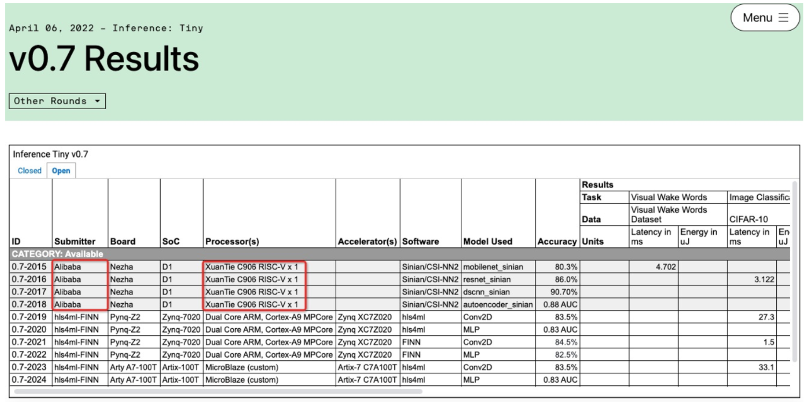
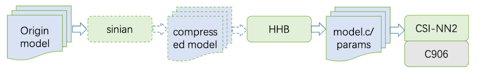
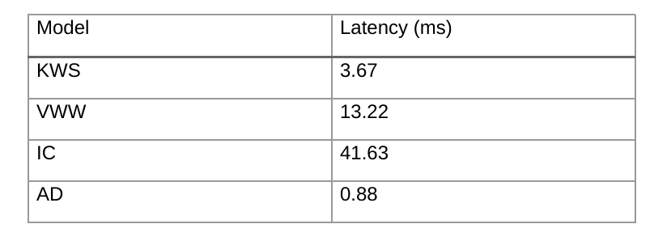

XuanTie C906 is a processor developed by Alibaba Cloud based on the RISC-V instruction set architecture. It has attained top marks in the most recent findings from [MLPerf Tiny v0.7](https://mlcommons.org/en/inference-tiny-07/), an AI benchmark focusing on IoT devices. The performance of XuanTie C906 excelled in all four core categories: Visual Wake Words (VWW), Image Classifications (IC), Keyword Spotting (KWS), and Anomaly Detection (AD).

## About MLPerf Tiny

MLPerf Tiny Inference is a benchmark developed by MLCommons. It is designed to measure the efficiency of processing new data by a trained neural network for extremely low-power devices., as well as providing an optional power measurement test.

The benchmark consists of four machine learning tasks that involve using microphone and camera sensors within embedded devices1:

* Keyword Spotting (KWS):  a feature that utilizes a neural network to detect keywords from a spectrogram
* Visual Wake Words (VWW): a binary image classification task to determine the presence of a person in an image
* Tiny Image Classification (IC):  a small image classification benchmark with 10 classes
* Anomaly Detection (AD): uses a neural network to identify abnormalities in machine operating sounds

The image below details the results.

## XuanTie C906 with the RISC-V Vector Extension

XuanTie C906 is a 64-bit high-energy processor based on a 64-bit RISC-V architecture. This processor is designed with a five to eight stage integer pipeline. It is also equipped with 128-bit vector operation units to deliver excellent performance. Not only does XuanTie C906 adopt a multi-channel and mode data prefetching technologies, it improves and optimizes data access bandwidth and prefetching.

The vector operation units of XuanTie C906 are designed to follow the specifications of RISC-V Vector extension V0.7.1. Data formats, including int8, int16, int32, int64, bf16, fp16, fp32, and fp64, are supported. In the benchmark we have used f16 as the default, with which Xuantie C906 achieved the best performance.

The XuanTie C906 silicon chip is used in Allwinner SoC D1, which has been put into full-scale production. Allwinner D1 has been embedded in various development boards and is available in the open market.

## Software Stack

As shown in the preceding flowchart, the original model is obtained from MLPerf Tiny. An optional next step is to then be compressed by Sinian. Subsequently, Heterogeneous Honey Badger (HHB) converts the model to function library calls which are supported by the CSI-NN2 API. CSI-NN2 finally implements neural network interfaces by using the vector operation units of XuanTie C906.

### CSI-NN2

CSI-NN2 is a set of API interfaces for neural network acceleration libraries. It abstracts various common neural network operators to form unified interfaces.

CSI-NN2 also implements an acceleration library for XuanTie CPU. This interface provides optimization code at the assembly level for the RISC-V Vector extension. The acceleration library has adapted to multiple data types of quantization schemes.

Combined with the automatic quantization function of HHB, CSI-NN2 can quickly change the original model from the single-precision floating-point data type to optimal so that the model can deliver the best performance on the development board.

The source code of CSI-NN2 has been made available on [GitHub](https://github.com/T-head-Semi/csi-nn2).

CSI-NN2 shares the specifications of RISCV-V Vector extension V0.7.1 in the implementation of neural network operator on XuanTie C906. Considering the features of the CPU hardware (such as pipeline dependence, branch prediction, or cache), CSI-NN2 fully excavates the parallel capabilities of the fp16 data format in the algorithm.

### HHB

HHB is a collection of tools provided by T-Head to deploy neural network models on XuanTie processors. These tools can be incorporated for compilation, profiling, and simulation. The framework is based on Apache TVM, which is an end-to-end machine learning compiler structure. 

The source code of HHB has been shared on [GitHub](https://github.com/T-head-Semi/tvm).

HHB supports the network model formats of Caffe, TensorFlow, ONNX, and TensorFlow Lite. It can convert these model formats into unified intermediate expressions for graphing performance optimization. 

In addition, HHB supports multiple quantization methods to handle various data types. This framework can automatically provide the optimal  scheme for the specified XuanTie CPU platform. After quantization, HHB generates a graph structure in C code from the intermediate expression. Each node of the graph structure is constructed by calling the CSI-NN2 API.

As a common deployment tool set, HHB can also access the original model in the benchmark with the following performance:

### Sinian
Sinian is a computing acceleration platform for neural network models. It utilizes technologies for model compression such as network structure search and knowledge distillation.

In the benchmark, Sinian has reduced the calculation workload of every model by three to eight times.

## Conclusion

This article describes the results the XuanTie C906 attained in the MLPerf Tiny v0.7 benchmark in terms of performance. XuanTie C906 implements the specifications of RISC-V Vector extension V0.7.1. It has been put into scale production and is available on [AliExpress](https://sipeed.aliexpress.com/store/group/RISC-V/1101739727_10000003584258.html?spm=a2g0o.store_pc_home.smartGrouping_6001928813303.10000003584258). In addition, the source code of CSI-NN2 and HHB have been open sourced and shared on GitHub.

[Read more details related to the hardware and software.](https://occ.t-head.cn/)

 
References:
[1] MLPerf Tiny Inference Benchmark. from: https://mlcommons.org/en/news/mlperf-tiny-v05/
