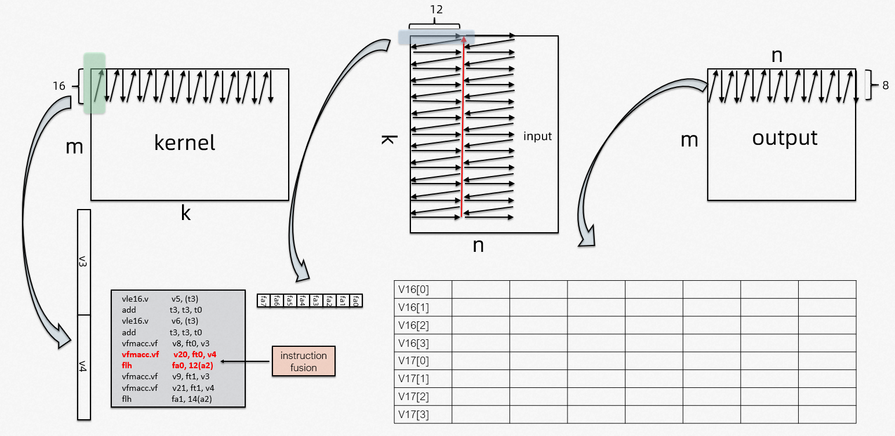
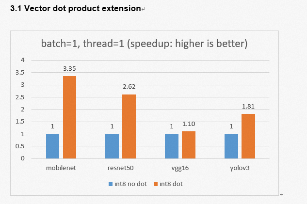
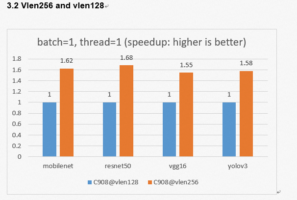
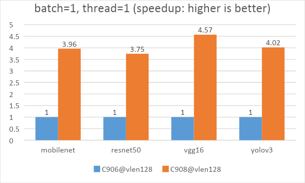

# 1. Introduction

[XuanTie C908](https://xrvm.com/?spm=a2cl5.27298783.0.0.6618272dxfNBdQ) is the latest RISC-V processor released by T-Head Semiconductor, It has a frequency of up to 2 GHz. which allows it to be widely used in visual AI, intelligent interaction, and other advanced technologies. This article focuses on an array of topics from processor micro-architecture, to convolution acceleration algorithm, to optimized operators for XuanTie C908. We are also showcasing the AI inference performance of XuanTie C908 by using the T-Head open source AI deployment kit for the first time.

# 2. AI acceleration of hardware and software integration

## 2.1 Processor micro-architecture

* Support instruction fusion technology
* Compliant with RISC-V vector extension 1.0
* Support 128/256 configurable vector register bit width VLEN
* The vector execution unit supports FP16/BFP16/FP32 floating point and INT8/INT32/INT64 integer operations
* Support INT8/INT4 vector dot product operations.

## 2.2 Software algorithm optimization
Structure of Heterogeneous Library (SHL) is a set of neural network library APIs for XuanTie CPU platform. It abstracts common neural network operator interfaces. For the newly released XuanTie C908, SHL provides the inference acceleration of multiple data types (fp32/fp16/int8). Combined with the processor pipeline, instruction fusion, and high-speed cache technology, it offers deep assembly optimization for core operators in neural networks.

Convolution has been the most crucial operator in CNN models. Currently, im2col + GEMM and Winograd are supported in SHL to accelerate convolution calculations. The main steps of Winograd are:

* Input padding
* Input transformation
* Input reordering
* Batch GEMM operations
* Output transformation
* Output cropping

The core computing of the two algorithms is gemm. The following figure uses vlen128/fp16 as an example to show the calculation process of gemm.



Vector load (vle) is used for weight data, while scalar load (flh) for input data. This design takes 16*12 register blocks to improve computational efficiency by performing outer product matrix. We manually remove read-after-write and write-after-write data dependencies to adjust instruction flow. Last but not least, we have incorporated advanced instruction fusion technology to fully optimize performance of XuanTie C908. (The arrows in the figure indicate the arrangement order of the data in the memory.)

The list of optimized operators supported by SHL for XuanTie C908 is as follows:

* conv2d
* depthwiseconv2d
* maxpool2d
* avgpool2d
* global_maxpool2d
* global_avgpool2d
* fullyconnected
* relu
* relu6
* leaky_relu
* prelu
* sigmoid
* softmax
* concat
* pad
* elementwise_add
* elementwise_mul
* sum

## 2.3 Model deployment

Heterogenous Honey Badger (HHB) has been adapted to the latest XuanTie C908 processor. It supports weight symmetric, activation asymmetric int8 data type quantization and fp16 data type quantization. One only needs a simple command to generate the C code model file for inference on XuanTie C908. While calling on the SHL XuanTie C908 high-performance inference computing library, you can achieve the best performance experience of model inference on XuanTie C908.

``` shell
hhb -C –calibrate-dataset ./cat.jpg –model-file ./mobilenetv1.prototxt ./mobilenetv1.caffemodel –data-scale 0.017 –data-mean ‘104 117 124’ –output . –board c908 –quantization-scheme=”int8_asym_w_sym” –pixel-format BGR –fuse-conv-relu –channel-quantization
```

# 3. Performance

We tested the AI inference performance of some common CNN models on XuanTie C908 using HHB and SHL. After adding the int8 vector dot product instruction, we improved XuanTie C908 performance by 3.35 times on mobilenet. This step enables us to expand the vector length to 256 results in a speedup ratio of 1.55 to 1.68. The AI performance provided by XuanTie C908 (@vlen128) has been increased by 3.75 to 4.57 times compared with that of the previous generation XuanTie C906 (@D1).

## 3.1 Vector dot product extension



## 3.2 Vlen256 and vlen128



## 3.3 XuanTie C908 and XuanTie C906



# 4. Conclusion

XuanTie C908 greatly improves AI computing power and performance. We have followed the standard RISC-V vector extension 1.0 and supported int8/int4 vector dot product extensions. Thus, we have provided 256-bit wide vector register configurable options for Xuantie C908. This article describes the specific steps of integration with micro-architecture and instruction characteristics of the XuanTie C908 processor. By doing so, we are able to accelerate the convolution operator in CNN and introduces the SHL high-performance computing library GEMM optimization ideas and the list of optimized operators. Moreover, we have compared the AI performance of XuanTie C908 and the previous generation XuanTie C906, further highlighting the potential and advantages of the RISIC-V processor architecture in the field of AIOT through software and hardware joint optimization.
