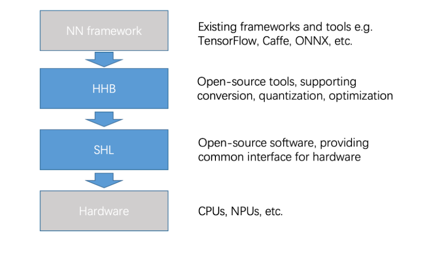
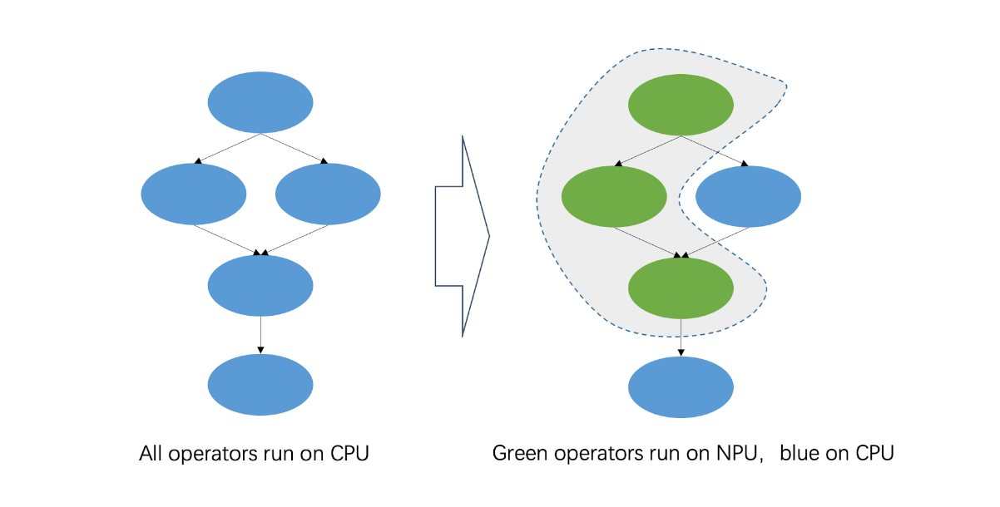
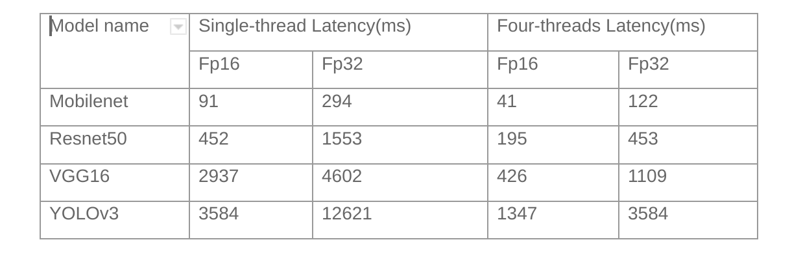
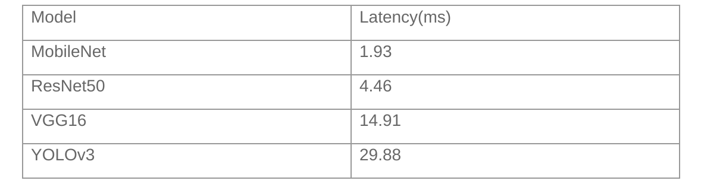

## Introduction

T-Head has recently introduced a high-performance SoC prototyping, i.e. TH1520, which is built on the Wujian600 chip development platform. With a quad-core XuanTie C910 CPU withbuilt-in 4-TOPS NPU, TH1520 engenders a new combination of CPU and AI computing. 

In this blog, we will describe the process of how to deploy a neural network model on C910 and on C910 and NPU simultaneously.

## Tools

T-Head offers two open-source deployment tools that enable seamless, highly efficient integration of NN frameworks and underlying hardware:

* Heterogeneous Honey Badge)(HHB): It supports models from different NN frameworks, and provides quantization and graph optimization.
* Structure of Heterogeneous Library (SHL): It is a common interface that is compatible with all hardware types, whil offering a reference schedule that facilitates software portability.



### HHB

[HHB](https://www.xrvm.com/tool-details?id=4056748601592913921#Download) is a collection of tools provided by T-Head to deploy neural network models on XuanTie processors. These tools can be incorporated for compilation, profiling, and simulation. 

Its framework is based on Apache TVM, which is an end-to-end machine learning compiler structure. We have shared the source code on [GitHub](https://github.com/T-head-Semi/tvm).

HHB supports models such as Caffe, TensorFlow, ONNX, and TensorFlow Lite. It can convert these models into unified intermediate expressions for graphing performance optimization.

In addition, HHB supports multiple quantization methods to handle various data types. This framework can automatically provide the optimal scheme for the specified XuanTie CPU platform. After quantization, HHB generates a graph structure in C code from the intermediate expression. Each node of the graph structure is constructed by calling the CSI-NN2 API.

Here is an example to use HHB in deploying MobileNet model on TH1520. The sample code shows the hhb command to compile the model:

``` shell
hhb -C --board light --calibrate-dataset ./cat.jpg --model-file ./mobilenetv1.prototxt ./mobilenetv1.caffemodel --data-mean "103.94 116.98 123.68" --data-scale 0.007843 --output . --quantization-scheme="int8_asym" --pixel-format BGR
```

The following content describes the parameter options:

* C: specifies to execute the main command until C code is generated.
* board: emphasizes as the destination platform; light is an alias of TH1520.
* calibrate-dataset: specifies the calibration image used for quantization.
* model-file: specifies a MobileNet model downloaded to the current directory. A Caffe model is divided into two files. The files following the option are not sequence-sensitive.
* data-mean: defines a mean.
* data-scale: defines a scale.
* output: describes the current directory as the path to store files that you need to generate.
* quantization-scheme: identifies a quantization scheme. 
* pixel-format: identifies the input image format required by the model training.

After the command is executed, multiple files such as main.c and model.c are generated in the current directory:

* main.c: the reference entry to the sample program.
* model.c: a model structure file that describes the model.
* hhb.hm: the weights converted to int8.
* io.c: the helper function for reading and writing files.
* io.h: the declaration of the helper function for above files.
* process.c: the image preprocessing function.
* process.h: the declaration of the above function.

After the HHB command generates code, the gcc command performs binary encoding.

``` shell
riscv64-unknown-linux-gnu-gcc -O0 -g3 -march=rv64gcv0p7_zfh_xtheadc -mabi=lp64d -I/home -I/home/install_nn2/include -I/home/decode/install/include -o c_runtime  main.c model.c io.c process.c -L/home/install_nn2/lib -L/home/decode/install/lib/rv -ljpeg -lpng -lz -lstdc++ -lshl_rvv -lm -static -Wl,--gc-sections
```

The following content describes the parameter options:

* O0 -g3: specifies the optimization option. In this example, you can use the debug-level O0 only.
* march: identifies the architecture option for C910.
* mabi: identifies the application binary interface (ABI) option for C910.
* I: describes the location of the header file that is used during compilation.
* o: describes the name of the executable file needed to generate.
* main.c model.c io.c process.c: the source file yu for compilation.
* L: specifies the path to store the specified library.
* ljpeg: links to a JPEG decoding library.
* lpng: links to a PNG decoding library.
* lz: links to a zlib.
* lstdc++: links to a standard C++ library.
* lshl_rvv: links to an optimized version library of C910 in SHL.
* lm: links to a standard math library.
* static: a static link.
* Wl,–gc-sections: recycles unused sections during linking.

After the compilation is complete, the c_runtime file is created under the current directory. Copy the hhb.bm file and the cat.jpg image that are generated by incorporating the hhb command and the c_runtime file to the development board of C910 to execute at a time:

``` shell
./c_runtime hhb.bm cat.jpg
```

You can view the top 5 execution results on the terminal. 

### SHL

SHL, previously called CSI-NN2,  is a neural network acceleration library.

It abstracts various common neural network operators to form unified interfaces. SHL also implements an acceleration library for XuanTie CPU. This interface offers optimization code at the assembly level for the RISC-V Vector extension. The acceleration library has adapted to multiple data types of quantization schemes.

Combined with the automatic quantization function of HHB, SHL can quickly change the original model from the single-precision floating-point data type to optimal. As a result,the model can deliver the best performance on the development board.

The source code of SHL has been made available on [GitHub](https://github.com/T-head-Semi/csi-nn2).

SHL shares the specifications of RISCV-V Vector extension V0.7.1 in the implementation of the neural network operator on XuanTie C910. Considering the features of the CPU hardware (such as pipeline dependence, branch prediction, or cache), SHL fully excavates the parallel capabilities of the fp16 data format in the algorithm.

To balance performance and accuracy, some SoCs may have an NPU to accelerate some int8 neural network operators. SHL provides one reference schedule module to find the best processor for  operators.



## C910 Performance

XuanTie C910 is a 64-bit high-performance processor based on the 64-bit RISC-V architecture. This processor adopts a state-of-the-art 12-stage and out-of-order multiple issue superscalar pipeline. On TH1520, it can clock up to 2.5GHz. It is also equipped with 128-bit vector operation units to deliver optimized performance. 

The vector operation units of XuanTie C910 are designed following version 0.7.1 of RISC-V Vector Extension. C910 supports wide-ranging data formats, including int8, int16, int32, int64, bf16, fp16, fp32, and fp64. fp16 is the default format for deploying network models, with which Xuantie C910 can achieve its best performance.

We have tested various typical image classification models. The table below presents the performance of our deployment software on C910 at 1.85 GHz.



As a comparison, [XNNPACK](https://github.com/google/XNNPACK) costs 77ms (multi-threaded) to infer a MobileNet model on Raspberry Pi 4B.

## C910 and NPU

In order to accelerate the convolution operator in the neural network, TH1520 is equipped with a 4-TOPS NPU. The NPU can also expedite more than 20 other operators in the neural network under int8.

The table below presents the performance of combining C910 and NPU to access typical image classification models:



## Conclusion

This article describes in details on how to deploy a neural network model on TH1520, We have also presented optimal performance of TH1520 in basic image classification tasks.

TH1520 has already been incorporated inside Alibaba’s ecosystem, which demonstrates the feasibility of RISC-V-based high-performance devices to deploy neural network models. In addition, the source code of deployment tools, HHB and SHL, has been open-sourced and shared on GitHub.

[Read more details related to the hardware and software.](https://www.xrvm.com/)
