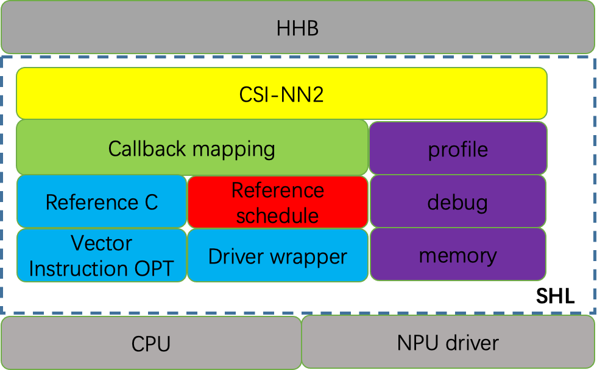

# Introduction

SHL (Structure of Heterogeneous Library, Chinese name: ShiHuLan) is a high-performance Heterogeneous computing library provided by T-HEAD. 
The interface of SHL uses T-HEAD neural network library API for XuanTie CPU platform: CSI-NN2, and provides a series of optimized binary libraries. 

The overall architecture is as follows: 

Features for SHL ：

* Reference implementation of c code version
* Assembly optimization implementation for XuanTie CPU
* Supports symmetric quantization and asymmetric quantization
* Support 8bit, 16bit, and f16 data types
* compaatible with NCHW and NHWC formates
* Use HHB to automatically call API
* Covers different architectures, such as CPU and NPU
* Reference heterogeneous schedule implementation 

In principle, SHL only provides the reference implementation of XuanTie CPU platform, and the optimization of each NPU target platform is completed by the vendor of the specific platform
